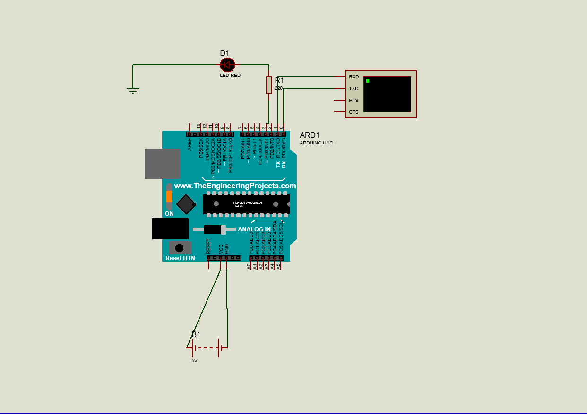
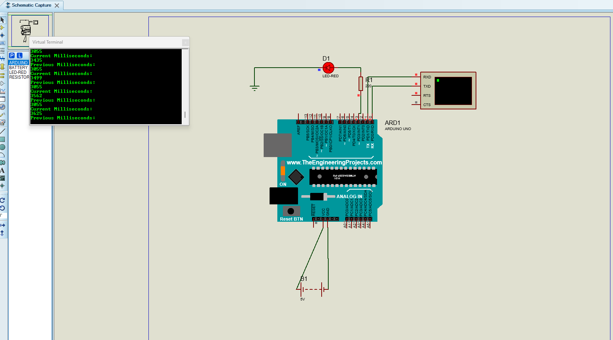

# Blink Without Delay Project

This project demonstrates how to make an LED blink without using the blocking `delay()` function. Instead, it uses `millis()` to track time and update the LED state only when the required interval has elapsed.

## Overview

The Blink Without Delay example is designed to:
- Avoid blocking the Arduino loop
- Track elapsed time with `millis()`
- Toggle an LED state when a time interval is reached
- Demonstrate a common timer pattern used in embedded applications

## Files Included

- `blinkwithoutdelay.pdsprj` - Proteus simulation project
- `blinkwithnodelayfunc/` - Arduino sketch folder
- `Project Backups/` - Autosaved and historical project versions
- `diagramlayout.png` - Circuit layout image
- `animatedversion.png` - Animated simulation preview
- `.workspace` file - Proteus workspace metadata

## Sketch Details

The main program is stored in:
- `blinkwithnodelayfunc/blinkwithnodelayfunc.ino`

It uses:
- `millis()` to measure elapsed time
- `previousMillis` to compare current time with the last state change
- `ledState` to keep the current LED status
- `interval` to control the blink timing

## How It Works

1. Arduino reads the current time with `millis()`.
2. It compares the difference between the current time and the previous saved value.
3. When the difference reaches the interval (for example, 1000 ms), the LED state changes.
4. The LED toggles between `HIGH` and `LOW` without freezing the program.

## Simulation Screenshots

### Circuit Layout


### Animated Version


## Basic Logic

```cpp
const int ledPin = 3;
int ledState = LOW;
unsigned long previousMillis = 0;
const long interval = 1000;

void loop() {
  unsigned long currentMillis = millis();

  if (currentMillis - previousMillis >= interval) {
    previousMillis = currentMillis;

    if (ledState == LOW) {
      ledState = HIGH;
    } else {
      ledState = LOW;
    }

    digitalWrite(ledPin, ledState);
  }
}
```

## Why This Method is Useful

- Keeps the Arduino responsive while timing events
- Helps manage multiple tasks at the same time
- Avoids delays that pause the entire program
- Is the foundation for non-blocking control systems

## Notes

- The LED is connected to a digital pin through a current-limiting resistor.
- Use a proper resistor value such as 220Ω to 470Ω.
- This pattern is often used in real-world Arduino projects, sensors, and automation systems.
