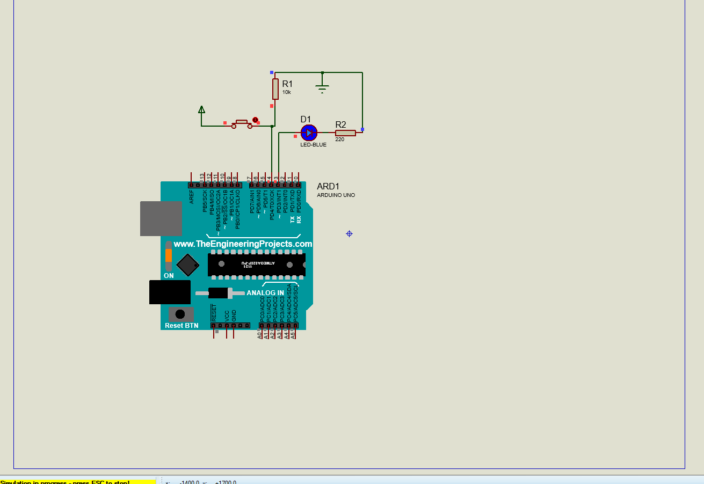
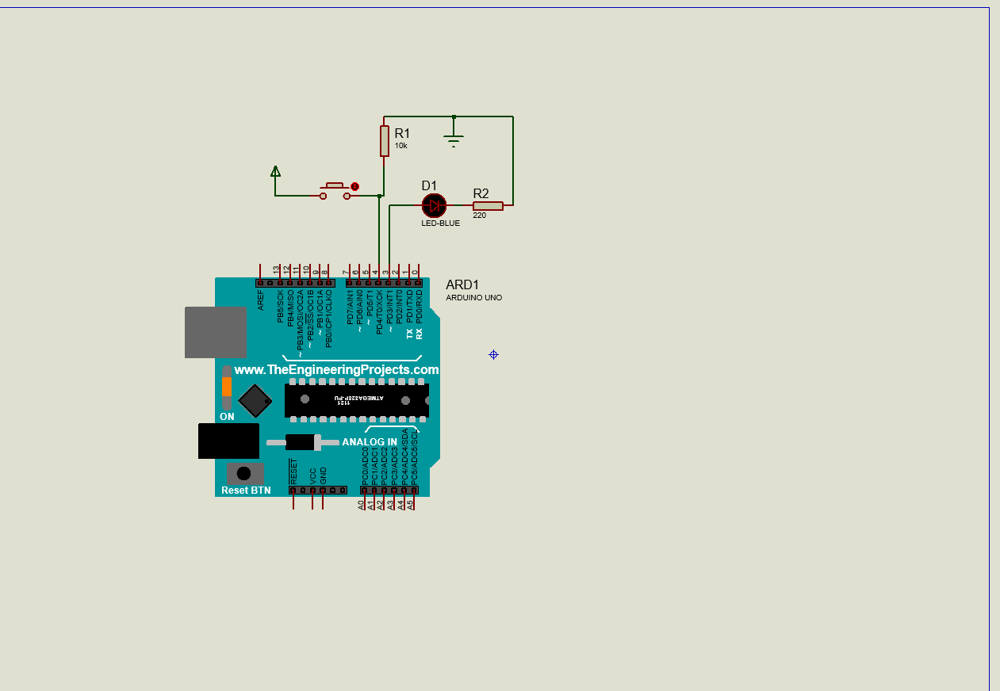
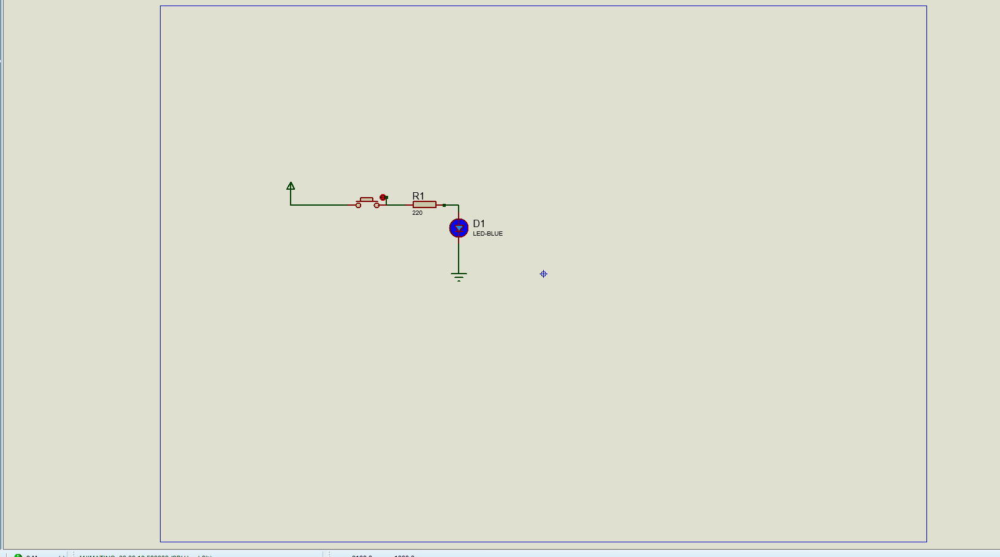
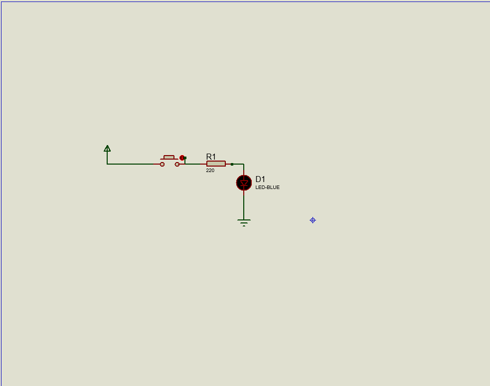

# Button Project

This project demonstrates how to read a push button with Arduino and use its state to control an LED in a Proteus simulation.

## Overview

The button circuit uses:
- Digital pin 4 as the push-button input
- Digital pin 3 as the LED output
- `digitalRead()` to read the button state
- `digitalWrite()` to copy the button state to the LED

When the button state is `HIGH`, the LED is turned on. When the button state is `LOW`, the LED is turned off.

## Files Included

- `button_arduino.pdsprj` - Arduino button simulation project
- `button_manual.pdsprj` - Manual button simulation project
- `button/button.ino` - Arduino sketch
- `images/` - Simulation images for the button on and off states
- `Project Backups/` - Historical Proteus project backups

## Circuit Operation

1. Arduino reads the state of the push button connected to digital pin 4.
2. The value returned by `digitalRead()` is stored in `buttonState`.
3. Arduino writes that value to the LED connected to digital pin 3.
4. The LED follows the button state in the simulation.

## Simulation Images

### Arduino Button On


### Arduino Button Off


### Manual Button On


### Manual Button Off


## Running the Simulation

1. Open either `button_arduino.pdsprj` or `button_manual.pdsprj` in Proteus Design Suite.
2. Start the simulation.
3. Press and release the virtual push button.
4. Observe the LED responding to the button state.

## Arduino Sketch

```cpp
const int led = 3;
const int pushButton = 4;

void setup() {
  pinMode(led, OUTPUT);
  pinMode(pushButton, INPUT);
}

void loop() {
  int buttonState = digitalRead(pushButton);
  digitalWrite(led, buttonState);
}
```

## Notes

- Use a defined input state with a pull-up or pull-down resistor when building the circuit on physical hardware.
- Use a current-limiting resistor with the LED.
- The Proteus schematic determines the exact switch and resistor wiring used in the simulation.
