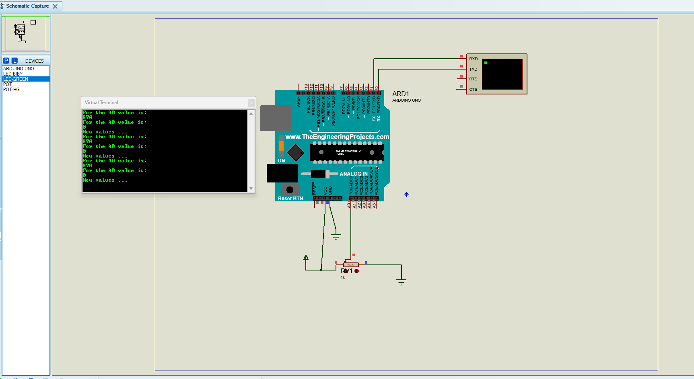

# Fade Project

This project demonstrates how an Arduino LED can be controlled using both manual analog input and automatic PWM fading. It shows the relationship between analog input values, PWM output, and brightness control.

## Overview

The Fade project includes two main modes:
- Manual fade control using analog readings from variable resistors or sensor inputs
- Automatic fade control using PWM output and a changing brightness value

## Files Included

- `fade_manual.pdsprj` - Manual fade simulation project
- `fade_pwm.pdsprj` - Automatic PWM fade simulation project
- `fade_manual/` - Arduino sketch for manual fade logic
- `fade_auto_pwm/` - Arduino sketch for automatic brightness fade
- `Project Backups/` - Backup copies of design files
- `fade_manual_image.png` - Simulation/project image

## Project Variations

### 1. Manual Fade
The manual sketch is stored in:
- `fade_manual/fade_manual.ino`

This version reads analog values from `A0` and `A3` and prints them to the serial monitor. It is useful for investigating how variable resistors or analog signals affect hardware readings.

### 2. Automatic PWM Fade
The automatic fade sketch is stored in:
- `fade_auto_pwm/fade_auto_pwm.ino`

This version uses:
- `const int ledPin = 6;`
- `analogWrite(ledPin, brightness);`
- `brightness += fadeAmount;`
- Conditional logic to reverse the fade direction at the limits

## How It Works

### Manual Fade
- The Arduino reads analog values from input pins.
- Those values are displayed via the Serial Monitor.
- The input can come from a variable resistor or a sensor.

### Automatic Fade
- A brightness variable increases from 0 to 255.
- `analogWrite()` sends a PWM signal to the LED.
- Once the maximum value is reached, the fade direction reverses.
- The LED appears to smoothly increase and decrease in brightness.

## Simulation Image

### Fade Example


## Basic PWM Logic

```cpp
const int ledPin = 6;
int brightness = 0;
int fadeAmount = 5;

void loop() {
  analogWrite(ledPin, brightness);
  brightness += fadeAmount;

  if (brightness <= 0 || brightness >= 255) {
    fadeAmount = -fadeAmount;
  }

  delay(30);
}
```

## Key Concepts

- Analog input reading with `analogRead()`
- PWM output with `analogWrite()`
- Variable/resistor-based input control
- Brightness modulation for LEDs
- Serial monitoring for debugging and learning

## Notes

- PWM pins are used for brightness control.
- Typical LED current limiting resistor values are 220Ω to 470Ω.
- `analogWrite()` works on PWM-capable pins such as 3, 5, 6, 9, 10, and 11 on common Arduino boards.
- The LED should be connected with correct polarity to avoid damage.
